# Human OOP examples

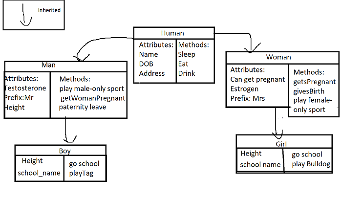
## Keywords

- `super()` - Used to give access to methods and properties of a parent
- `__init__` - Lets the class initialize the objects attributes
- `pass` - Used as a placeholder for future code (used to prevent errors from occuring)
- `class NAME:` - Creates a class
- `def NAME:` - Creates a method for the object in the class (for classes)
- `self` - Reference to the current object
## Classes

### Human
```python
class Human:
    def __init__(self, name, dob, address):
        self.name = name
        self.dob = dob
        self.address = address
        self.height = 0


    def sleep(self):
        return "zzz"

    def eat(self):
        return "yum"

    def drink(self):
        return "slurp"

```
### Man
```python
from human import Human


class Male(Human):
    def __init__(self, name, dob, address):
        super().__init__(name, dob, address)
        self.__testosterone = True
        self._can_get_pregnant = False
        self.prefix = "Mr"
        self.height = "1.80"

    def getsWomanPregnant(self):
        return "wow I am looking forward to having a kid"

    def paternityLeave(self):
        return "cant wait to look after my kid"

    def playMaleSport(self):
        return "this is so much fun! "
```


### Boy
```python
from male import Male


class Boy(Male):
    def __init__(self, name, dob, address, school):
        super().__init__(name, dob, address)
        self.height = "0.8"
        self.school = school
        self.language = "undeveloped"

    def goSchool(self):
        return "i love learning"

    def playTag(self):
        return "so fun wow!!! "

    def read_action(self):
        return "wow this book is so cool. "
```
### Woman
```python
from human import Human


class Woman(Human):
    def __init__(self, name, dob, address):
        super().__init__(name, dob, address)
        self.__estrogen = True
        self._can_get_pregnant = True
        self.prefix = "Ms"
        self.height = "1.40"

    def __getsPregnant(self):
        return "wow I am looking forward to having a kid"

    def __givesBirth(self):
        return "this hurts"

    def play_female_sport(self):
        return "this is so fun! "

```
### Girl
```python
from female import Woman


class Girl(Woman):
    def __init__(self, name, dob, address, school_name):
        super().__init__(name, dob, address)
        self.height = "0.9"
        self._can_get_pregnant = False
        self.school = school_name
        self.language = "undeveloped"

    def sleep(self):
        return "zzz"

    def playBulldog(self):
        return "yum"

    def read_horror(self):
        return "ah so scary! "
```

## Examples of the Four Pillars
### Abstraction
#### 1. User does not have to see the complexity
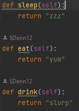
#### 2. User only has to enter this to get the result
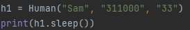
#### 3. The result (as expected):
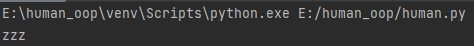
### Encapsulation
#### 1. Private attribute declared
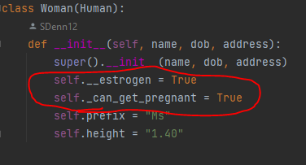
#### 2. Tries to call the private attribute
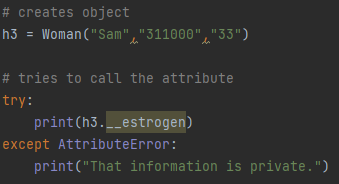
#### 3. Returns the attribute error
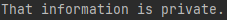
### Inheritance
#### 1. Declares an attribute called prefix in the Male class
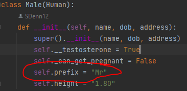
#### 2. Calls the for the prefix attribute in a boy object
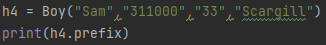
#### 3. Recalls the male prefix
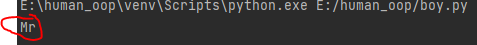

### Polymorphism
#### 1. Height assigned in Woman class
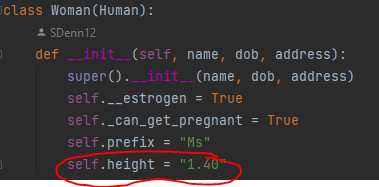
#### 2. Height is eassigned in girls class
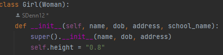
#### 3. Call height for girl object
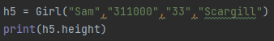
#### 4.
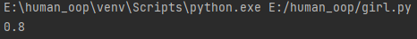
